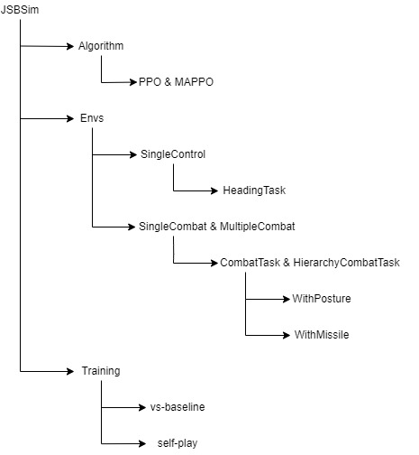
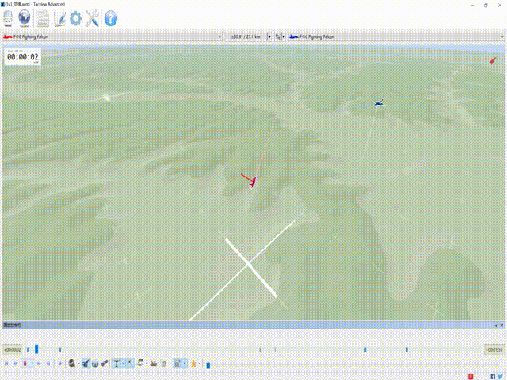

# Light Aircraft Game: A lightweight, scalable, gym-wrapped aircraft competitive environment with baseline reinforcement learning algorithms
We provide a competitive environment for red and blue aircrafts games, which includes single control setting, 1v1 setting and 2v2 setting. The flight dynamics based on JSBSIM, and missile dynamics based on our implementation of proportional guidance. We also provide ppo and mappo implementation for self-play or vs-baseline training. 



## Install 

```shell
# create python env
conda create -n jsbsim python=3.8
# install dependency
pip install torch pymap3d jsbsim==1.1.6 geographiclib gym==0.20.0 wandb icecream setproctitle. 

- Download Shapely‑1.7.1‑cp38‑cp38‑win_amd64.whl from [here](https://www.lfd.uci.edu/~gohlke/pythonlibs/#shapely), and `pip install shaply` from local file.

- Initialize submodules(*JSBSim-Team/jsbsim*): `git submodule init; git submodule update`
```
## Envs
We provide all task configs in  `envs/JSBSim/configs`, each config corresponds to a task.

### SingleControl
SingleControl env includes single agent heading task, whose goal is to train agent fly according to the given direction, altitude and velocity. The trained agent can be used to design baselines or become the low level policy of the following combat tasks. We can designed two baselines, as shown in the video:


The red is manever_agent, flying in a triangular trajectory. The blue is pursue agent, constantly tracking the red agent. You can reproduce this by `python envs/JSBSim/test/test_baseline_use_env.py`.


### SingleCombat
SingleCombat env is for two agents 1v1 competitive tasks, including NoWeapon tasks and Missile tasks. We provide self-play setting and vs-baseline setting for each task. Due to the fact that learning to fly and combat simultaneously is non-trival, we also provide a hierarchical framework, where the upper level control gives the direction, altitude and velocity, the low level control use the model trained in SingleControl. 


- NoWeapon tasks require the agent to be in an posture advantage, which means the agent need to fly towards the tail of its opponent and maintain a proper distance. 
- Missile tasks require the agent learn to shoot down oppoents and dodge missiles. Missile engines are based on proportional guidance, we provide a document for our impletation [here](docs/missile_engine). We can futher divide missile tasks into into two categories:
  - Dodge missile task. Missile launches are controled by rules, train agent learn to dodge missile.
  - Shoot missile task. Missile launches are also learning goals. But training from scratch to learn launching missiles is not trival, we need to introduce some prior knowledge for policy learning. We use property that conjugate prior of binomial distribution is beta distribution to address this issue, refer to [here](docs/parameterized_shooting.md) for more details.  A demo for shoot missile task:




### MultiCombat
MultiCombat env is for four agents 2v2 competitive tasks. The setting is same as SingleCombat. A demo for non-weapon tasks: 


## Quick Start
### Training

```bash
cd scripts
bash train_*.sh
```
We have provide scripts for five tasks in `scripts/`.

- `train_heading.sh` is for SingleControl environment heading task.
- `train_vsbaseline.sh` is for SingleCombat vs-baseline tasks.
- `train_selfplay.sh` is for SingleCombat self-play tasks. 
- `train_selfplay_shoot.sh` is for SingleCombat self-play shoot missile tasks.
- `train_share_selfplay.sh` is for MultipleCombat self-play tasks.

It can be adapted to other tasks by modifying a few parameter settings. 

- `--env-name` includes options ['SingleControl', 'SingleCombat', 'MultipleCombat'].
- `--scenario` corresponds to yaml file in `envs/JBSim/configs` one by one.
- `--algorithm` includes options [ppo, mappo], ppo for SingleControl and SingleCombat, mappo for MultipleCombat

The description of parameter setting refers to `config.py`.
Note that we set parameters `--use-selfplay --selfplay-algorithm --n-choose-opponents --use-eval --n-eval-rollout-threads --eval-interval --eval-episodes` in selfplay-setting training. `--use-prior` is only set true for shoot missile tasks.
We use wandb to track the training process. If you set `--use-wandb`, please replace the `--wandb-name` with your name. 

### Evaluate and Render
```bash
cd renders
python render*.py
```
This will generate a `*.acmi` file. We can use [**TacView**](https://www.tacview.net/), a universal flight analysis tool, to open the file and watch the render videos.

## Citing
If you find this repo useful, pleased use the following citation:
````
@misc{liu2022light,
  author = {Qihan Liu and Yuhua Jiang and Xiaoteng Ma},
  title = {Light Aircraft Game: A lightweight, scalable, gym-wrapped aircraft competitive environment with baseline reinforcement learning algorithms},
  year = {2022},
  publisher = {GitHub},
  journal = {GitHub repository},
  howpublished = {\url{https://github.com/liuqh16/CloseAirCombat}},
}
